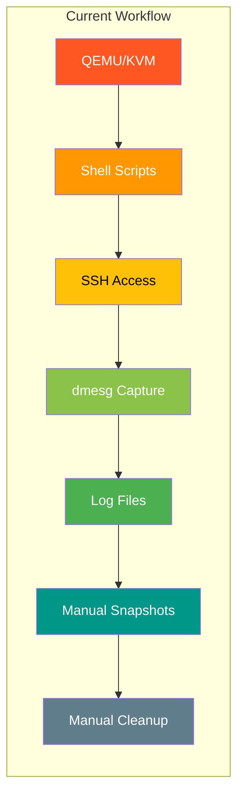
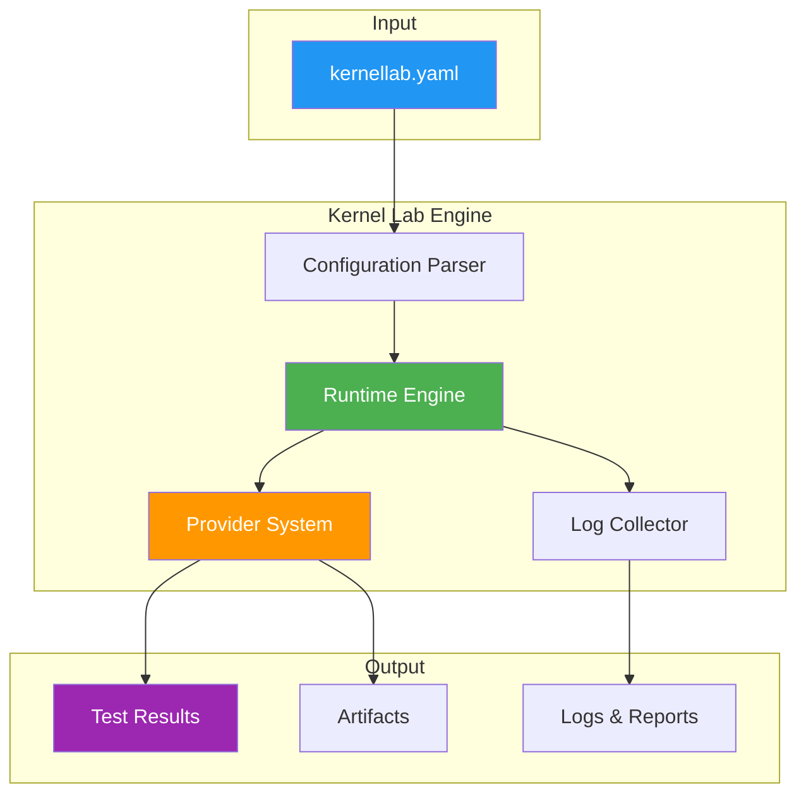
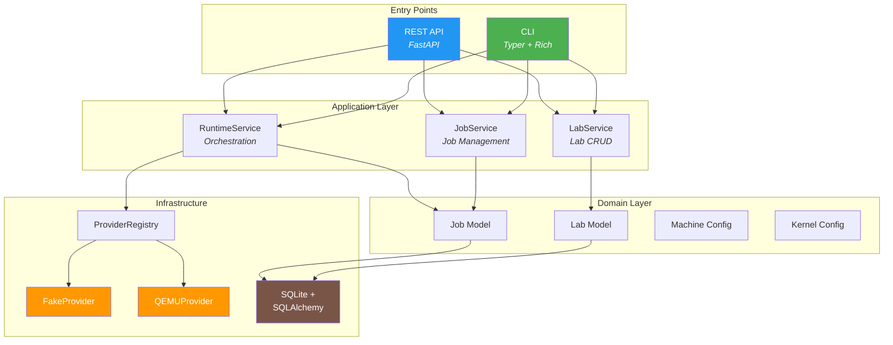
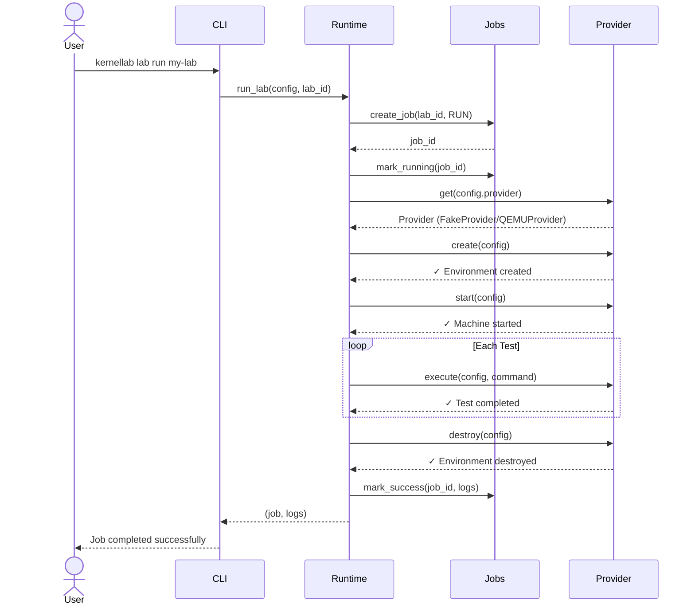
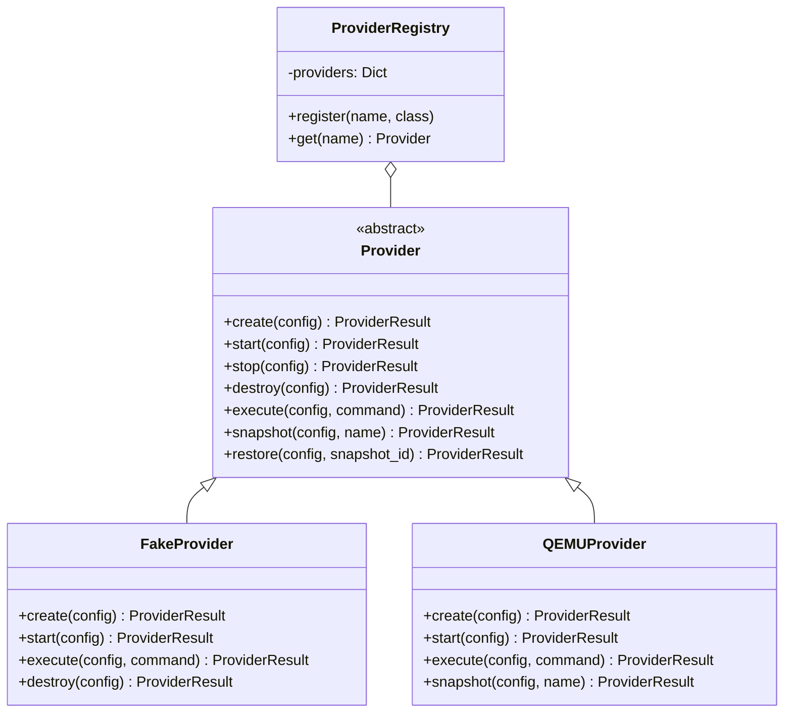
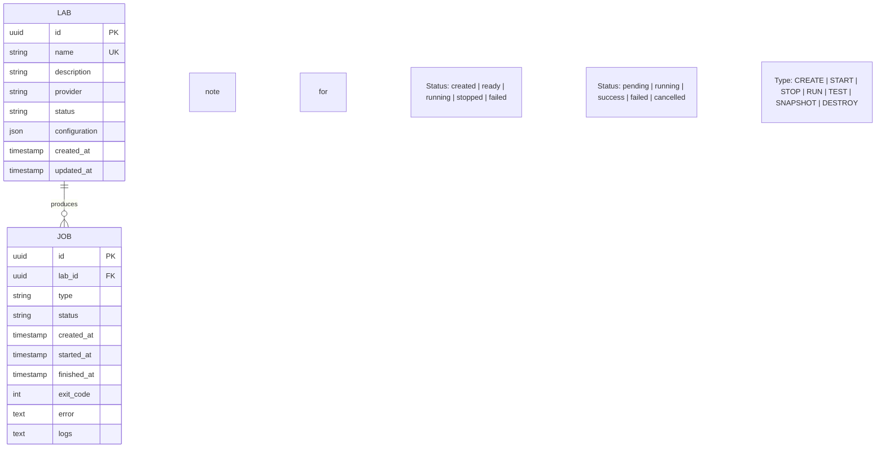
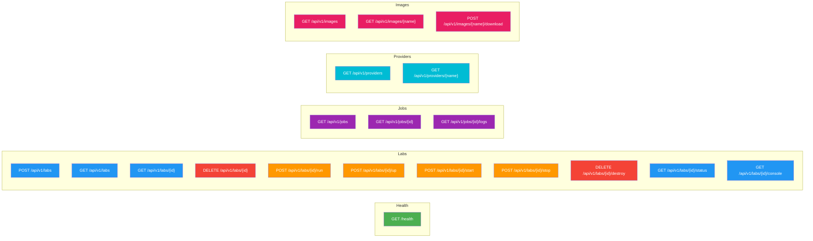

# Kernel Lab

<p align="center">
  <strong>A reproducible laboratory for kernel and driver development.</strong>
</p>

<p align="center">
  <a href="#quick-start">Quick Start</a> •
  <a href="#architecture">Architecture</a> •
  <a href="#cli-commands">CLI</a> •
  <a href="#api-reference">API</a> •
  <a href="#development">Development</a> •
  <a href="https://github.com/melinskyRf/kernellab/blob/main/docs/roadmap.md">Roadmap</a>
</p>

<p align="center">
  
  
  
  
  
  
</p>

<p align="center">
  
  
  
  
  
  
</p>

<p align="center">
  
  
  
  
</p>

---

> ⚠️ **Kernel Lab is currently under development.** This release (Phase 2) now includes real virtual machine integration with QEMU/KVM. The FakeProvider is still available for development and testing.

> 📦 **Release Policy:** Formal releases (tags + GitHub Releases) will only be created when the project reaches **100% completion**. Until then, all updates are pushed directly to the `main` branch. Watch the repository to be notified when the first official release is available.

---

## Why Kernel Lab?

Kernel and driver development is powerful — but the tooling around it is fragmented. Developers today must manually orchestrate a dozen different tools just to test a single kernel module:



**The pain is real:**

| Scenario | Today | With Kernel Lab |
|----------|-------|-----------------|
| Test a driver that might crash | Manually create VM, configure, boot, copy module, hope for the best | `kernellab lab run` — disposable VM, automatic recovery |
| Test across kernel versions | Create 3+ VMs manually, maintain each | Single `kernellab.yaml` config, run against multiple kernels |
| Share setup with teammate | Zip VM image + 10-page README | Share `kernellab.yaml` — one command to reproduce |
| Debug kernel panic | Rebuild VM, reconfigure serial console, lose previous state | Snapshots + automatic log capture |
| CI/CD for kernel modules | Custom scripts, fragile, hard to maintain | Native API + GitHub Actions integration |

**Kernel Lab solves this** by providing a single interface that orchestrates virtualization, kernel management, testing, and observability — all driven by a simple YAML configuration.

---

## What Kernel Lab Does



One command does everything:

```bash
kernellab lab run my-driver-lab
```

This single command will (in Phase 2):

1. **Parse** your `kernellab.yaml` configuration
2. **Create** a disposable virtual machine
3. **Boot** the specified kernel version
4. **Copy** your modules into the VM
5. **Execute** your test suite
6. **Capture** console output and dmesg
7. **Detect** kernel panics or failures
8. **Save** artifacts and logs
9. **Destroy** the environment (or keep it for debugging)

---

## Example Configuration

```yaml
version: 1
name: my-driver
description: Test environment for my custom driver

provider: qemu

machine:
  architecture: x86_64
  cpus: 4
  memory: 4G
  disk: 20G

kernel:
  version: "6.12"
  cmdline: "console=ttyS0 nokaslr"

workspace:
  source: ./src

tests:
  - name: load-module
    command: insmod my_driver.ko

  - name: verify-loaded
    command: lsmod | grep my_driver

  - name: check-dmesg
    command: dmesg | tail -100

  - name: run-functional-tests
    command: ./run-tests.sh

provider_options:
  timeout: 300
  fail_on_panic: true
```

This configuration is **self-documenting** and **reproducible** — anyone on your team can run the exact same test environment with a single command.

---

## Features

| Feature | Status | Description |
|---------|--------|-------------|
| **CLI** | ✅ Available | Full command-line interface with Typer + Rich |
| **REST API** | ✅ Available | FastAPI-based API with auto-generated docs |
| **Lab Configuration** | ✅ Available | YAML-based config with validation |
| **Job System** | ✅ Available | Track and manage test executions |
| **Fake Provider** | ✅ Available | Simulated provider for development/testing |
| **Persistent Logs** | ✅ Available | Logs stored in `.kernellab/logs/` |
| **Provider System** | ✅ Available | Pluggable architecture for VM backends |
| **QEMU/KVM Provider** | ✅ Available | Real VM execution via QEMU |
| **Kernel Boot** | ✅ Available | Boot custom kernels in VMs |
| **Driver Injection** | ✅ Available | Auto-copy `.ko` files to VMs |
| **Snapshot/Restore** | ✅ Available | Save and restore VM state |
| **Serial Console** | ✅ Available | Direct console access to VMs |
| **Crash Detection** | ✅ Available | Automatic kernel panic detection |
| **KUnit Integration** | 🔜 Planned | Run kernel unit tests |
| **kselftest Integration** | 🔜 Planned | Run kernel self-tests |
| **Web Dashboard** | 🔜 Planned | Browser-based management UI |
| **Remote Workers** | 🔜 Planned | Execute across multiple machines |
| **ARM64 Emulation** | 🔜 Planned | Test on different architectures |

---

## Phase 2 — Real Virtualization

Phase 2 brings real virtual machine integration to Kernel Lab, enabling actual kernel and driver testing in isolated environments.

### What's New in Phase 2

- **Real VM execution** via QEMU/KVM with hardware acceleration
- **VirtualBox support** as an alternative provider
- **Kernel boot** — boot custom kernel versions in VMs
- **Driver injection** — automatically copy `.ko` files to VMs
- **Serial console** — direct console access for debugging
- **Snapshot/restore** — save and restore VM state
- **Crash detection** — automatic kernel panic detection and recovery
- **Image management** — download, list, and manage VM images

### CLI Commands

#### Provider Management

```bash
# Check system requirements for virtualization
kernellab doctor

# List available providers
kernellab provider list

# Show provider details
kernellab provider show qemu
```

#### Image Management

```bash
# List available images
kernellab image list

# Download a kernel image
kernellab image download ubuntu-22.04 --kernel 6.12

# Show image details
kernellab image show ubuntu-22.04
```

#### Lab Lifecycle

```bash
# Create a lab environment
kernellab lab up my-driver-lab

# Start an existing lab
kernellab lab start my-driver-lab

# Stop a running lab
kernellab lab stop my-driver-lab

# Destroy a lab and clean up resources
kernellab lab destroy my-driver-lab

# Check lab status
kernellab lab status my-driver-lab

# Open a console to the running VM
kernellab lab console my-driver-lab
```

### Example Configuration

```yaml
version: 1
name: my-driver-lab
description: Test environment for my custom driver

provider: qemu

machine:
  architecture: x86_64
  cpus: 4
  memory: 4G
  disk: 20G

kernel:
  version: "6.12"
  cmdline: "console=ttyS0 nokaslr"

network:
  type: user
  hostfags:
    - hostfwd: tcp::2222-:22

serial:
  enabled: true
  port: /tmp/kernellab-serial.sock

runtime:
  image: ubuntu-22.04
  timeout: 300
  fail_on_panic: true

workspace:
  source: ./src

tests:
  - name: load-module
    command: insmod my_driver.ko

  - name: verify-loaded
    command: lsmod | grep my_driver

  - name: check-dmesg
    command: dmesg | tail -100

  - name: run-functional-tests
    command: ./run-tests.sh
```

### Example Workflow

```bash
# 1. Check system requirements
kernellab doctor

# 2. Download a kernel image
kernellab image download ubuntu-22.04 --kernel 6.12

# 3. Initialize your project
mkdir my-driver-lab
cd my-driver-lab
kernellab init

# 4. Edit kernellab.yaml with your configuration

# 5. Validate configuration
kernellab config validate

# 6. Start the lab (creates VM, boots kernel, runs tests)
kernellab lab up my-driver-lab

# 7. Check lab status
kernellab lab status my-driver-lab

# 8. Open console for debugging
kernellab lab console my-driver-lab

# 9. Stop the lab when done
kernellab lab stop my-driver-lab

# 10. Destroy to clean up resources
kernellab lab destroy my-driver-lab
```

---

## Architecture

Kernel Lab follows a clean **layered architecture** with clear separation of concerns:



### Key Design Principles

| Principle | Description |
|-----------|-------------|
| **Layered Architecture** | Clear separation between CLI/API, Services, Domain, and Infrastructure |
| **Provider Abstraction** | Virtualization backend is pluggable — swap QEMU for VirtualBox without changing business logic |
| **Shared Service Layer** | CLI and API use the same services — no duplicated logic |
| **Repository Pattern** | Database access is abstracted behind repositories |
| **Configuration as Code** | Everything defined in `kernellab.yaml` — version controlled, reproducible |

---

### How `kernellab lab run` Works



---

### Provider System

The provider system allows Kernel Lab to support multiple virtualization backends:



> **Adding a new provider** is simple: implement the `Provider` abstract class and register it in the `ProviderRegistry`. No other code needs to change. Phase 2 includes both FakeProvider (for development/testing) and QEMUProvider (for real VM execution).

---

### Data Model



---

## Quick Start

### Prerequisites

- **Python 3.12** or higher
- **pip** or **uv** package manager

### Installation

```bash
# Clone the repository
git clone https://github.com/melinskyRf/kernellab.git
cd kernel-lab

# Create virtual environment
python -m venv .venv
source .venv/bin/activate  # Linux/macOS
# .venv\Scripts\Activate.ps1  # Windows

# Install with development dependencies
pip install -e ".[dev]"
```

Or with [uv](https://docs.astral.sh/uv/):

```bash
uv sync
```

### Verify Installation

```bash
$ kernellab --version
Kernel Lab 0.2.0

$ kernellab --help
Usage: kernellab [OPTIONS] COMMAND [ARGS]...

  A reproducible laboratory for kernel and driver development.

Options:
  --version  -v  Show version and exit.
  --help         Show this message and exit.

Commands:
  init     Initialize kernellab.yaml and .kernellab/ directory.
  logs     Show logs for a specific job.
  server   Start the Kernel Lab API server.
  lab      Manage labs.
  job      Manage jobs.
  config   Manage configuration.
  doctor   Check system requirements.
  provider Manage providers.
  image    Manage VM images.
```

---

## Your First Lab

Follow these steps to create and run your first lab:

### Step 1: Initialize

```bash
mkdir my-first-lab
cd my-first-lab
kernellab init
```

This creates:

```
my-first-lab/
├── kernellab.yaml      # Configuration file
└── .kernellab/         # Working directory
    ├── logs/           # Job logs
    ├── artifacts/      # Test artifacts
    └── runtime/        # Runtime data
```

### Step 2: Configure

Edit `kernellab.yaml`:

```yaml
version: 1
name: my-first-lab
provider: fake

machine:
  architecture: x86_64
  cpus: 2
  memory: 2G

kernel:
  version: "6.12"

tests:
  - name: hello-test
    command: echo "Hello from Kernel Lab!"
```

### Step 3: Validate

```bash
kernellab config validate
```

### Step 4: Create and Run

```bash
# Create and start the lab
kernellab lab up my-first-lab

# Or create and run separately
kernellab lab create my-first-lab
kernellab lab run my-first-lab
```

Output:

```
Kernel Lab

Lab: my-first-lab

✓ Environment created
✓ Machine started
✓ Kernel boot simulated
✓ Tests executed
✓ Logs collected

Job completed successfully.

Job ID: 01HXYZ123456...
```

### Step 5: Inspect Results

```bash
# List all jobs
kernellab job list

# View job details
kernellab job show 01HXYZ123456...

# View logs
kernellab logs 01HXYZ123456...

# Check lab status
kernellab lab status my-first-lab

# Open console for debugging
kernellab lab console my-first-lab

# Stop the lab
kernellab lab stop my-first-lab

# Destroy the lab when done
kernellab lab destroy my-first-lab
```

---

## CLI Commands

### Core Commands

| Command | Description | Example |
|---------|-------------|---------|
| `kernellab init` | Initialize a new project | `kernellab init` |
| `kernellab --version` | Show version | `kernellab -v` |
| `kernellab server` | Start API server | `kernellab server --port 8000` |
| `kernellab doctor` | Check system requirements | `kernellab doctor` |

### Provider Management

| Command | Description | Example |
|---------|-------------|---------|
| `kernellab provider list` | List available providers | `kernellab provider list` |
| `kernellab provider show <name>` | Show provider details | `kernellab provider show qemu` |

### Image Management

| Command | Description | Example |
|---------|-------------|---------|
| `kernellab image list` | List available images | `kernellab image list` |
| `kernellab image download <name>` | Download a VM image | `kernellab image download ubuntu-22.04` |
| `kernellab image show <name>` | Show image details | `kernellab image show ubuntu-22.04` |

### Lab Management

| Command | Description | Example |
|---------|-------------|---------|
| `kernellab lab create <name>` | Create a new lab | `kernellab lab create driver-test` |
| `kernellab lab list` | List all labs | `kernellab lab list` |
| `kernellab lab show <name>` | Show lab details | `kernellab lab show driver-test` |
| `kernellab lab delete <name>` | Delete a lab | `kernellab lab delete driver-test` |
| `kernellab lab run <name>` | Run a lab | `kernellab lab run driver-test` |
| `kernellab lab up <name>` | Create and start lab | `kernellab lab up driver-test` |
| `kernellab lab start <name>` | Start an existing lab | `kernellab lab start driver-test` |
| `kernellab lab stop <name>` | Stop a running lab | `kernellab lab stop driver-test` |
| `kernellab lab destroy <name>` | Destroy a lab | `kernellab lab destroy driver-test` |
| `kernellab lab status <name>` | Check lab status | `kernellab lab status driver-test` |
| `kernellab lab console <name>` | Open console to VM | `kernellab lab console driver-test` |

### Job Management

| Command | Description | Example |
|---------|-------------|---------|
| `kernellab job list` | List all jobs | `kernellab job list` |
| `kernellab job show <id>` | Show job details | `kernellab job show 01HXYZ...` |
| `kernellab logs <id>` | View job logs | `kernellab logs 01HXYZ...` |

### Configuration

| Command | Description | Example |
|---------|-------------|---------|
| `kernellab config validate` | Validate config file | `kernellab config validate` |

---

## API Reference

Start the API server:

```bash
kernellab server
```

The server starts at `http://127.0.0.1:8000`.

### Interactive Documentation

- **Swagger UI**: http://127.0.0.1:8000/docs
- **ReDoc**: http://127.0.0.1:8000/redoc

### Endpoints



### Example Requests

```bash
# Health check
curl http://127.0.0.1:8000/health
# → {"status": "ok", "service": "kernellab"}

# Create a lab
curl -X POST http://127.0.0.1:8000/api/v1/labs \
  -H "Content-Type: application/json" \
  -d '{"name": "my-lab", "provider": "fake"}'

# List all labs
curl http://127.0.0.1:8000/api/v1/labs

# Run a lab
curl -X POST http://127.0.0.1:8000/api/v1/labs/{lab_id}/run

# Get job logs
curl http://127.0.0.1:8000/api/v1/jobs/{job_id}/logs

# List providers
curl http://127.0.0.1:8000/api/v1/providers

# List images
curl http://127.0.0.1:8000/api/v1/images

# Download an image
curl -X POST http://127.0.0.1:8000/api/v1/images/ubuntu-22.04/download

# Start a lab
curl -X POST http://127.0.0.1:8000/api/v1/labs/{lab_id}/start

# Stop a lab
curl -X POST http://127.0.0.1:8000/api/v1/labs/{lab_id}/stop

# Destroy a lab
curl -X DELETE http://127.0.0.1:8000/api/v1/labs/{lab_id}/destroy

# Get lab status
curl http://127.0.0.1:8000/api/v1/labs/{lab_id}/status
```

---

## Development

### Project Structure

```
kernel-lab/
├── src/kernellab/           # Source code
│   ├── cli/                 # CLI commands (Typer)
│   ├── api/                 # REST API (FastAPI)
│   ├── domain/              # Domain models
│   ├── application/         # Application services
│   ├── providers/           # Provider system
│   │   ├── base.py          # Abstract provider interface
│   │   ├── fake/            # FakeProvider for development
│   │   ├── qemu/            # QEMU/KVM provider
│   │   └── virtualbox/      # VirtualBox provider
│   ├── persistence/         # Database layer
│   ├── config/              # Configuration
│   ├── schemas/             # Pydantic schemas
│   ├── images/              # Image management
│   └── runtime/             # Runtime orchestration
├── tests/                   # Test suite
│   ├── unit/                # Unit tests
│   ├── integration/         # API tests
│   └── cli/                 # CLI tests
├── docs/                    # Documentation
│   └── diagrams/            # Mermaid diagrams
└── examples/                # Example configurations
```

### Available Commands

```bash
make install      # Install with dev dependencies
make test         # Run all tests
make test-cov     # Run tests with coverage
make lint         # Check code style (ruff)
make format       # Format code (ruff)
make typecheck    # Run type checks (mypy)
make run          # Start API server
make clean        # Remove build artifacts
```

### Running Tests

```bash
# Run all tests
make test

# Run specific test categories
pytest tests/unit/ -v           # Unit tests
pytest tests/integration/ -v    # API integration tests
pytest tests/cli/ -v            # CLI tests

# Run with coverage
make test-cov
```

### Code Quality

```bash
# Linting
make lint

# Auto-fix lint issues
ruff check --fix src/ tests/

# Formatting
make format

# Type checking
make typecheck
```

### Database

Kernel Lab uses SQLite for persistence. The database is stored at `.kernellab/kernellab.db`.

To reset the database:

```bash
rm .kernellab/kernellab.db
kernellab init  # Recreates the database
```

---

## Docker

> ⚠️ **Docker is for API development only.** Containers share the host kernel and are **not** the isolation mechanism for Kernel Lab. Real kernel isolation requires virtualization (QEMU/KVM), which is now available in Phase 2.

```bash
# Start the API server in Docker
docker compose up

# Or build and run
docker build -t kernellab .
docker run -p 8000:8000 kernellab
```

---

## Security Considerations

Kernel code and drivers can be dangerous. They can:

- **Kernel panic** — crash the entire system
- **Memory corruption** — corrupt data across processes
- **Deadlocks** — hang the system indefinitely
- **Network disruption** — bring down network interfaces
- **Filesystem corruption** — destroy data permanently

**Kernel Lab executes potentially dangerous code inside disposable virtual machines.** In Phase 2, all test execution happens in isolated VMs that are destroyed after each run.

> ⚠️ **Never run untrusted kernel modules directly on your host machine.** Always use Kernel Lab's isolated environments.

---

## Project Principles

| Principle | Description |
|-----------|-------------|
| **Reproducible** | Same `kernellab.yaml` produces identical environment every time |
| **Disposable** | VMs are created and destroyed — no state to manage |
| **Observable** | Every operation generates logs and artifacts |
| **Automatable** | All operations scriptable via CLI or API |
| **Provider-independent** | No lock-in to QEMU, VirtualBox, or any specific tool |
| **Developer-friendly** | Simple commands, clear errors, fast feedback loops |
| **Safe by default** | Destructive operations require explicit confirmation |

---

## What Kernel Lab Is NOT

Kernel Lab **does not replace** the tools you already use. It **orchestrates** them:

| Tool | Relationship |
|------|--------------|
| **QEMU/KVM** | Kernel Lab manages VM lifecycle |
| **VirtualBox** | Kernel Lab can use it as a backend |
| **KUnit** | Kernel Lab can run and collect results |
| **kselftest** | Kernel Lab can integrate test suites |
| **Linux** | Kernel Lab runs on Linux (and others) |

Kernel Lab is a layer of **orchestration**, **automation**, and **observability** on top of existing technologies — not a replacement for them.

---

## Roadmap

The full roadmap is available in [docs/roadmap.md](docs/roadmap.md).

**Current Status: Phase 2 — Real Virtualization ✅**

- [x] Project architecture
- [x] CLI with Typer + Rich
- [x] REST API with FastAPI
- [x] Domain models
- [x] Application services
- [x] Provider system with FakeProvider
- [x] SQLite persistence
- [x] Configuration system
- [x] Comprehensive test suite (58 tests)
- [x] Documentation and diagrams
- [x] QEMU/KVM integration
- [x] VM lifecycle management
- [x] Kernel boot
- [x] Serial console
- [x] SSH communication
- [x] VirtualBox support
- [x] Image management
- [x] Crash detection

**Next: Phase 3 — Advanced Features**

- [ ] Web Dashboard
- [ ] Remote Workers
- [ ] ARM64 Emulation
- [ ] KUnit Integration
- [ ] kselftest Integration
- [ ] CI/CD Integration

---

## Contributing

We welcome contributions! See [CONTRIBUTING.md](CONTRIBUTING.md) for:

- Development setup
- Code style guidelines
- Testing requirements
- Pull request process

---

## License

This project is licensed under the **Apache License 2.0** — see [LICENSE](LICENSE) for details.

---

<p align="center">
  Built with ❤️ for the Linux kernel community.
</p>
